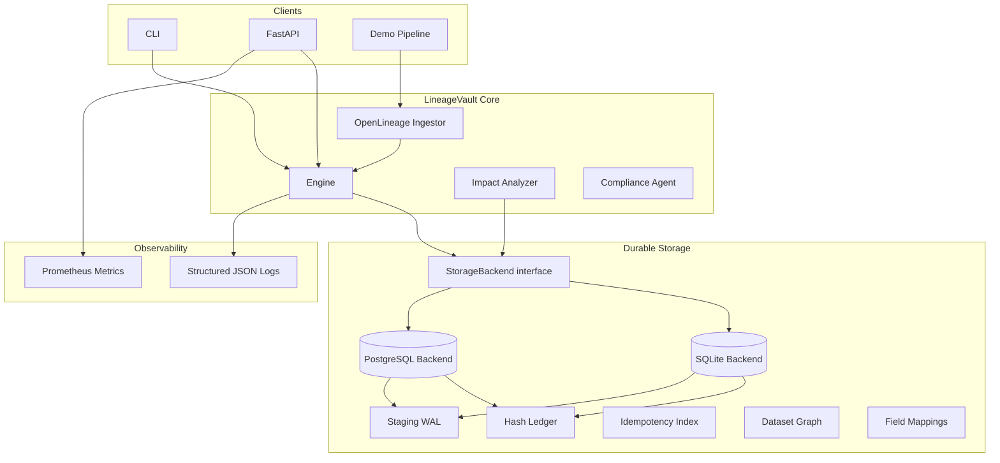

# Architecture

## Components

- **Storage interface** — transactional acknowledge + batch semantics with idempotency keys.
- **SQLite backend** — WAL journal mode, migrations, batch writes, crash replay.
- **PostgreSQL backend** — same contract with connection pooling via psycopg, transactional batch ingest.
- **OpenLineage adapter** — single and batch `RunEvent` ingestion with dataset + field lineage.
- **Impact analyzer** — downstream dataset and field traversal.
- **API/CLI** — health, readiness, metrics, ingest, lineage, impact, demo workflow.

## Data flow

1. Client sends OpenLineage `COMPLETE` event (single or batch).
2. Storage acknowledges writes in one transaction (idempotency + WAL + ledger).
3. Dataset edges and field mappings recorded for graph queries.
4. Impact API traverses downstream dependencies.

## Configuration

Backend selection via `LINEAGE_VAULT_BACKEND` and `LINEAGE_VAULT_POSTGRES_DSN`. See [ADR 0002](adr/0002-pluggable-storage-backends.md).
