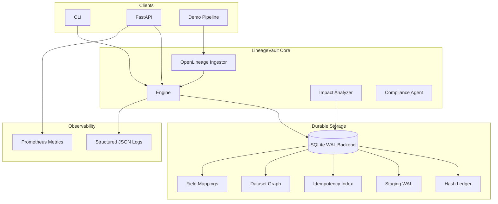

# Architecture

## Components

- **Storage interface** — transactional acknowledge semantics with idempotency keys.
- **SQLite backend** — single-database WAL mode, migrations, indexes, crash replay.
- **OpenLineage adapter** — ingests `RunEvent` payloads, records dataset + field lineage.
- **Impact analyzer** — downstream dataset and field traversal.
- **API/CLI** — health, metrics, ingest, lineage, impact, demo workflow.

## Data flow

1. Client sends OpenLineage `COMPLETE` event (or legacy event).
2. Storage acknowledges write in one transaction (idempotency + WAL + ledger).
3. Dataset edges and field mappings recorded for graph queries.
4. Impact API traverses downstream dependencies.
